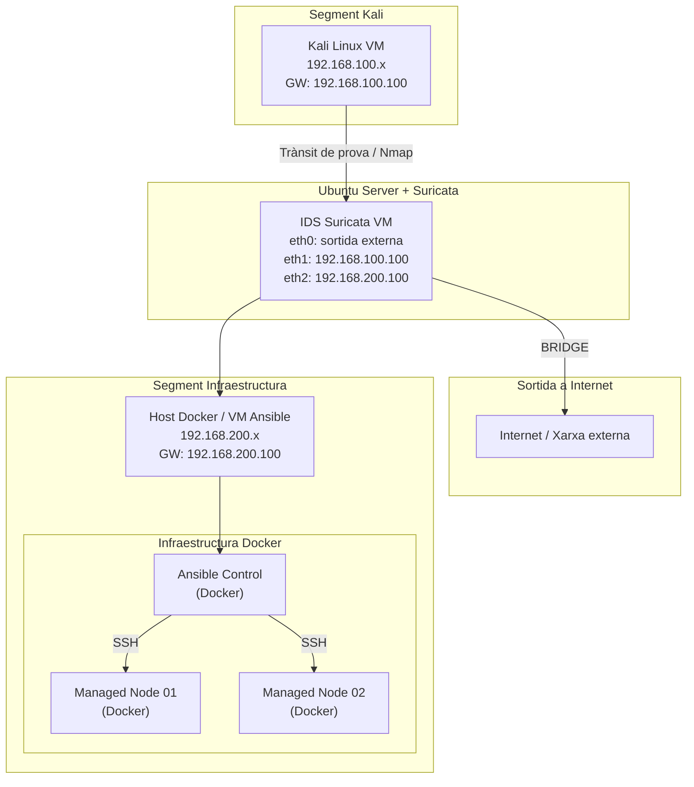

# Projecte Infraestructura Automatitzada + IDS/IPS amb Suricata

## Descripció del Projecte

Aquest projecte combina dues parts principals d’una infraestructura de sistemes:

1. **Automatització d’infraestructura amb Ansible**
2. **Monitorització de seguretat amb un sistema IDS/IPS (Suricata)**

L’objectiu és construir un laboratori complet que permeti:

- desplegar serveis de forma automatitzada
- gestionar múltiples nodes de forma centralitzada
- monitoritzar el trànsit de xarxa
- detectar possibles atacs

La infraestructura combina **Docker, Ansible, Suricata i Elastic Stack** per simular un entorn similar al d’una infraestructura real.

---

# Objectius del Projecte

## Automatització (Ansible)

- Implementar un **node de control Ansible**
- Gestionar múltiples **nodes gestionats**
- Automatitzar instal·lació de serveis
- Desplegar configuracions mitjançant playbooks
- Gestionar infraestructura de forma declarativa

## Seguretat (IDS/IPS)

- Implementar un **IDS funcional amb Suricata**
- Detectar escaneigs de ports i trànsit sospitós
- Simular atacs reals amb Kali Linux
- Analitzar logs de seguretat
- Visualitzar alertes amb Elastic Stack

---

# Arquitectura del Laboratori

## Components principals

| Sistema | Funció |
|-------|-------|
| Kali Linux | Simulació d’atacs |
| Ubuntu Server | IDS + router de xarxa |
| Host Docker | Infraestructura Ansible |
| Ansible Control | Node de control |
| Managed Node 01 | Node gestionat |
| Managed Node 02 | Node gestionat |

---

# Arquitectura de Xarxa

La infraestructura està dividida en **dos segments interns** connectats mitjançant el sistema IDS.

- **Segment Kali** → xarxa d’atac
- **Segment Infraestructura** → servidors gestionats

L’IDS també proporciona **sortida a Internet mitjançant NAT**.

---

## Esquema de Xarxa



---

# Configuració de Routing i NAT

Per permetre la comunicació entre les dues xarxes internes i proporcionar accés a Internet als sistemes del laboratori, el servidor Ubuntu amb Suricata es configura com a **router amb NAT**.

Aquest sistema disposa de tres interfícies:

| Interfície | Xarxa | Funció |
|-------------|------|--------|
| enp0s3 | 192.168.100.0/24 | Segment Kali |
| enp0s8 | 192.168.200.0/24 | Segment infraestructura |
| enp0s9 | Xarxa externa | Sortida a Internet |

Les dues xarxes internes utilitzen el servidor IDS com a **gateway**:

- Kali → 192.168.100.100
- Infraestructura → 192.168.200.100

---

# Activació d’IP Forwarding

Per permetre que el sistema actuï com a router es necessita activar el forwarding IP.

Fitxer:

```
/etc/sysctl.conf
```

Configuració:

```bash
net.ipv4.ip_forward=1
```

Aplicar configuració:

```bash
sudo sysctl -p
```

---

# Configuració IPTABLES

Per permetre la comunicació entre les xarxes internes i proporcionar accés a Internet als sistemes del laboratori, el servidor Ubuntu amb Suricata es configura com a **router amb NAT utilitzant iptables**.

Inicialment les regles es van aplicar manualment amb `iptables`, però aquestes **no són persistents** i es perden després de reiniciar el sistema. Per aquest motiu es va configurar la persistència utilitzant el paquet `iptables-persistent`.

---

# Regla NAT (sortida a Internet)

La següent regla permet que els hosts de les xarxes internes surtin a Internet utilitzant la IP externa del servidor IDS.

```bash
sudo iptables -t nat -A POSTROUTING -o enp0s9 -j MASQUERADE
```

La interfície `enp0s9` és la que proporciona la connexió cap a Internet.

---

# Regles de Forwarding

Encara que el forwarding ja està habilitat amb `ip_forward`, es defineixen explícitament les regles per permetre el trànsit entre les xarxes internes i Internet.

Permetre que les xarxes internes surtin a Internet:

```bash
sudo iptables -A FORWARD -i enp0s3 -o enp0s9 -j ACCEPT
sudo iptables -A FORWARD -i enp0s8 -o enp0s9 -j ACCEPT
```

Permetre el retorn de connexions establertes des d’Internet:

```bash
sudo iptables -A FORWARD -i enp0s9 -o enp0s3 -m state --state RELATED,ESTABLISHED -j ACCEPT
sudo iptables -A FORWARD -i enp0s9 -o enp0s8 -m state --state RELATED,ESTABLISHED -j ACCEPT
```

---

# Persistència de les regles

Per evitar que les regles es perdin després de reiniciar la màquina virtual es va instal·lar el paquet:

```bash
sudo apt install iptables-persistent
```

Aquest paquet guarda les regles dins del fitxer:

```
/etc/iptables/rules.v4
```

En aquest projecte, després d’un reinici de la màquina virtual, les regles es van afegir manualment en aquest fitxer per garantir que el sistema continuï funcionant com a router després de cada arrencada.

Exemple de configuració dins del fitxer:

```
*nat
:PREROUTING ACCEPT [0:0]
:INPUT ACCEPT [0:0]
:OUTPUT ACCEPT [0:0]
:POSTROUTING ACCEPT [0:0]

-A POSTROUTING -o enp0s9 -j MASQUERADE

COMMIT


*filter
:INPUT ACCEPT [0:0]
:FORWARD ACCEPT [0:0]
:OUTPUT ACCEPT [0:0]

-A FORWARD -i enp0s3 -o enp0s9 -j ACCEPT
-A FORWARD -i enp0s8 -o enp0s9 -j ACCEPT
-A FORWARD -i enp0s9 -o enp0s3 -m state --state RELATED,ESTABLISHED -j ACCEPT
-A FORWARD -i enp0s9 -o enp0s8 -m state --state RELATED,ESTABLISHED -j ACCEPT

COMMIT
```

Després de modificar el fitxer es poden aplicar les regles amb:

```bash
sudo netfilter-persistent reload
```

---

# Funcionament

Amb aquesta configuració:

- Kali i la infraestructura poden comunicar-se entre elles
- Els hosts interns poden accedir a Internet
- Tot el trànsit passa pel servidor IDS
- Suricata pot analitzar el trànsit entre segments
- Les regles de xarxa es mantenen després de reiniciar el sistema

Aquest model permet centralitzar la monitorització de xarxa i facilita la detecció d’activitats sospitoses dins del laboratori.

---

# Infraestructura d’Automatització (Ansible)

## Node de Control

El node de control Ansible s’executa dins un **contenidor Docker**.

Funcions:

- executar playbooks
- gestionar inventari
- connectar via SSH amb nodes gestionats
- garantir l’estat desitjat de la infraestructura

---

## Inventari

Fitxer:

```
inventory/hosts
```

Exemple:

```bash
[clients]
managed-node-01 ansible_host=managed-node-01 ansible_user=ansible ansible_password=ansible ansible_become_password=ansible
managed-node-02 ansible_host=managed-node-02 ansible_user=ansible ansible_password=ansible ansible_become_password=ansible
```

---

## Execució del Playbook

```bash
ansible-playbook -i /inventory/hosts /ansible/setup_web.yml
```

Aquest playbook automatitza:

- actualització del sistema
- instal·lació de serveis web
- configuració del servidor

---

# Sistema IDS amb Suricata

## Instal·lació

```bash
sudo apt update
sudo apt install suricata -y
```

Verificació:

```bash
suricata --version
```

Execució manual:

```bash
sudo suricata -c /etc/suricata/suricata.yaml -i eth1
```

---

# Configuració de Regles

Instal·lació regles ET Open:

```bash
sudo suricata-update
```

Regla personalitzada:

Fitxer:

```
/var/lib/suricata/rules/local.rules
```

```bash
alert tcp any any -> $HOME_NET any (flags:S; msg:"SCAN TCP SYN detectat"; sid:1000001; rev:1;)
```

---

# Simulació d’Atacs

Escaneig des de Kali:

```bash
nmap -sS -T4 -p- 192.168.200.x
```

Aquest trànsit passa per l’IDS i genera alertes.

---

# Visualització amb Elastic Stack

Logs enviats amb **Filebeat** cap a **Elasticsearch** i visualitzats a **Kibana**.

Filtre per alertes:

```
event.kind: alert
```

Filtre per regla:

```
rule.id: 1000001
```

---

# Estat Actual del Projecte

Automatització:

- Ansible control node funcional
- Inventari configurat
- Nodes gestionats operatius
- Playbooks funcionant
- Infraestructura Docker desplegada

Seguretat:

- IDS Suricata funcional
- Regles ET Open carregades
- Regla personalitzada implementada
- Simulació d’atacs Nmap
- Logs enviats a Elasticsearch
- Alertes visualitzades a Kibana

---

# Tecnologies Utilitzades

- Ansible
- Docker
- Suricata
- Elasticsearch
- Kibana
- Filebeat
- Kali Linux
- Ubuntu Server
- VirtualBox

---

# Autor

Projecte desenvolupat com a pràctica d’**ASIX2** combinant:

- Automatització de configuració amb **Ansible**
- Implementació d’un sistema **IDS/IPS amb Suricata**
