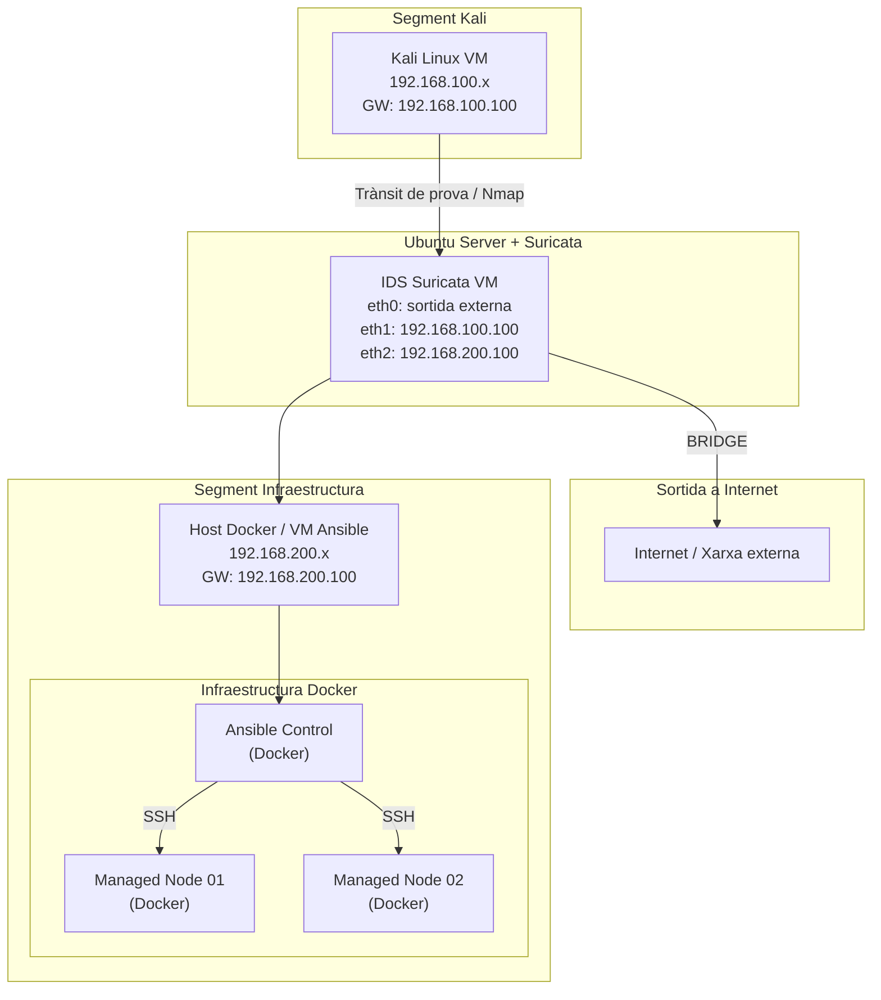

# Projecte Infraestructura Automatitzada + IDS/IPS amb Suricata

## Descripció del Projecte

Aquest projecte combina dues parts principals d’una infraestructura de sistemes:

1. **Automatització d’infraestructura amb Ansible**
2. **Monitorització de seguretat amb un sistema IDS/IPS (Suricata)**

L’objectiu és construir un laboratori complet que permeti:

- desplegar serveis de forma automatitzada
- gestionar múltiples nodes de forma centralitzada
- monitoritzar el trànsit de xarxa
- detectar possibles atacs

La infraestructura combina **Docker, Ansible, Suricata i Elastic Stack** per simular un entorn similar al d’una infraestructura real.

---

# Objectius del Projecte

## Automatització (Ansible)

- Implementar un **node de control Ansible**
- Gestionar múltiples **nodes gestionats**
- Automatitzar instal·lació de serveis
- Desplegar configuracions mitjançant playbooks
- Gestionar infraestructura de forma declarativa

## Seguretat (IDS/IPS)

- Implementar un **IDS funcional amb Suricata**
- Detectar escaneigs de ports i trànsit sospitós
- Simular atacs reals amb Kali Linux
- Analitzar logs de seguretat
- Visualitzar alertes amb Elastic Stack

---

# Arquitectura del Laboratori

## Components principals

| Sistema | Funció |
|-------|-------|
| Kali Linux | Simulació d’atacs |
| Ubuntu Server | IDS + router de xarxa |
| Host Docker | Infraestructura Ansible |
| Ansible Control | Node de control |
| Managed Node 01 | Node gestionat |
| Managed Node 02 | Node gestionat |

---

# Arquitectura de Xarxa

La infraestructura està dividida en **dos segments interns** connectats mitjançant el sistema IDS.

- **Segment Kali** → xarxa d’atac
- **Segment Infraestructura** → servidors gestionats

L’IDS també proporciona **sortida a Internet mitjançant NAT**.

---

## Esquema de Xarxa



---

# Configuració de Routing i NAT

Per permetre la comunicació entre les dues xarxes internes i proporcionar accés a Internet als sistemes del laboratori, el servidor Ubuntu amb Suricata es configura com a **router amb NAT**.

Aquest sistema disposa de tres interfícies:

| Interfície | Xarxa | Funció |
|-------------|------|--------|
| enp0s3 | 192.168.100.0/24 | Segment Kali |
| enp0s8 | 192.168.200.0/24 | Segment infraestructura |
| enp0s9 | Xarxa externa | Sortida a Internet |

Les dues xarxes internes utilitzen el servidor IDS com a **gateway**:

- Kali → 192.168.100.100
- Infraestructura → 192.168.200.100

---

# Activació d’IP Forwarding

Per permetre que el sistema actuï com a router es necessita activar el forwarding IP.

Fitxer:

```
/etc/sysctl.conf
```

Configuració:

```bash
net.ipv4.ip_forward=1
```

Aplicar configuració:

```bash
sudo sysctl -p
```

---

# Configuració IPTABLES

Per permetre la comunicació entre les xarxes internes i proporcionar accés a Internet als sistemes del laboratori, el servidor Ubuntu amb Suricata es configura com a **router amb NAT utilitzant iptables**.

Inicialment les regles es van aplicar manualment amb `iptables`, però aquestes **no són persistents** i es perden després de reiniciar el sistema. Per aquest motiu es va configurar la persistència utilitzant el paquet `iptables-persistent`.

---

# Regla NAT (sortida a Internet)

La següent regla permet que els hosts de les xarxes internes surtin a Internet utilitzant la IP externa del servidor IDS.

```bash
sudo iptables -t nat -A POSTROUTING -o enp0s9 -j MASQUERADE
```

La interfície `enp0s9` és la que proporciona la connexió cap a Internet.

---

# Regles de Forwarding

Encara que el forwarding ja està habilitat amb `ip_forward`, es defineixen explícitament les regles per permetre el trànsit entre les xarxes internes i Internet.

Permetre que les xarxes internes surtin a Internet:

```bash
sudo iptables -A FORWARD -i enp0s3 -o enp0s9 -j ACCEPT
sudo iptables -A FORWARD -i enp0s8 -o enp0s9 -j ACCEPT
```

Permetre el retorn de connexions establertes des d’Internet:

```bash
sudo iptables -A FORWARD -i enp0s9 -o enp0s3 -m state --state RELATED,ESTABLISHED -j ACCEPT
sudo iptables -A FORWARD -i enp0s9 -o enp0s8 -m state --state RELATED,ESTABLISHED -j ACCEPT
```

---

# Persistència de les regles

Per evitar que les regles es perdin després de reiniciar la màquina virtual es va instal·lar el paquet:

```bash
sudo apt install iptables-persistent
```

Aquest paquet guarda les regles dins del fitxer:

```
/etc/iptables/rules.v4
```

En aquest projecte, després d’un reinici de la màquina virtual, les regles es van afegir manualment en aquest fitxer per garantir que el sistema continuï funcionant com a router després de cada arrencada.

Exemple de configuració dins del fitxer:

```
*nat
:PREROUTING ACCEPT [0:0]
:INPUT ACCEPT [0:0]
:OUTPUT ACCEPT [0:0]
:POSTROUTING ACCEPT [0:0]

-A POSTROUTING -o enp0s9 -j MASQUERADE

COMMIT


*filter
:INPUT ACCEPT [0:0]
:FORWARD ACCEPT [0:0]
:OUTPUT ACCEPT [0:0]

-A FORWARD -i enp0s3 -o enp0s9 -j ACCEPT
-A FORWARD -i enp0s8 -o enp0s9 -j ACCEPT
-A FORWARD -i enp0s9 -o enp0s3 -m state --state RELATED,ESTABLISHED -j ACCEPT
-A FORWARD -i enp0s9 -o enp0s8 -m state --state RELATED,ESTABLISHED -j ACCEPT

COMMIT
```

Després de modificar el fitxer es poden aplicar les regles amb:

```bash
sudo netfilter-persistent reload
```

---

# Funcionament

Amb aquesta configuració:

- Kali i la infraestructura poden comunicar-se entre elles
- Els hosts interns poden accedir a Internet
- Tot el trànsit passa pel servidor IDS
- Suricata pot analitzar el trànsit entre segments
- Les regles de xarxa es mantenen després de reiniciar el sistema

Aquest model permet centralitzar la monitorització de xarxa i facilita la detecció d’activitats sospitoses dins del laboratori.

---

# Infraestructura d’Automatització (Ansible)

La infraestructura d'automatització es basa en **Ansible**, que permet gestionar i configurar diversos servidors de forma centralitzada.

Ansible s'executa dins un **contenidor Docker que actua com a node de control**, mentre que els servidors gestionats també s'executen com a contenidors Debian.

Aquesta configuració permet crear un laboratori fàcilment reproduïble i modular.

---

# Node de Control

El node de control Ansible s'executa dins un contenidor Docker basat en **Debian 12**.

Aquest node és responsable d'automatitzar la configuració dels servidors utilitzant **playbooks d’Ansible**.

Les seves funcions principals són:

- executar playbooks
- gestionar inventaris de hosts
- establir connexions SSH amb els nodes gestionats
- garantir que els sistemes mantinguin l'estat desitjat

L'ús de Docker permet:

- desplegament ràpid
- reproduïbilitat del laboratori
- separació del sistema host
- flexibilitat per modificar la infraestructura

---

# Nodes Gestionats

Els nodes gestionats representen servidors dins la infraestructura.

Cada node s'executa com un **contenidor Docker basat en Debian 12** i disposa d'un servidor **SSH** que permet la seva gestió des d'Ansible.

Els nodes gestionats permeten demostrar:

- instal·lació de paquets
- configuració automatitzada de serveis
- desplegament d'aplicacions web
- gestió d'usuaris i permisos
- aplicació de configuracions de sistema

---

# Inventari

Els nodes gestionats es defineixen dins del fitxer:

```
inventory/hosts
```

Exemple d'inventari utilitzat en el laboratori:

```
[clients]
managed-node-01 ansible_host=managed-node-01 ansible_user=ansible ansible_password=ansible ansible_become_password=ansible
managed-node-02 ansible_host=managed-node-02 ansible_user=ansible ansible_password=ansible ansible_become_password=ansible
```

Aquest inventari permet que Ansible gestioni múltiples nodes de forma centralitzada.

---

# Execució del Playbook

La configuració dels servidors es realitza executant el següent comandament des del node de control:

```
ansible-playbook -i /inventory/hosts /ansible/setup_web.yml
```

Aquest playbook aplica la configuració sobre tots els nodes definits al grup **clients**.

---

# Tasques Automatitzades

El playbook implementa diverses tasques que permeten demostrar diferents aspectes d'automatització.

---

## Aprovisionament

El sistema realitza automàticament les següents tasques d'aprovisionament:

- instal·lació de paquets base (`git`, `vim`, `curl`, `cron`)
- creació del grup `devops`
- creació de l'usuari `deploy`
- creació del directori `/opt/webapp`

Exemple de tasca Ansible:

```
- name: Crear grup devops
  group:
    name: devops
    state: present
```

---

## Desplegament d’Aplicacions

El laboratori desplega una aplicació web utilitzant **Nginx**.

Tasques realitzades:

- instal·lació del servidor web Nginx
- activació del servei
- desplegament d'una pàgina web personalitzada
- clonació d'un repositori Git amb contingut d'exemple

Exemple de tasca:

```
- name: Instal·lar nginx
  apt:
    name: nginx
    state: present
```

També es realitza la clonació d'un repositori Git dins del directori de treball.

```
- name: Clonar aplicació web des de Git
  git:
    repo: https://github.com/docker/awesome-compose.git
    dest: /opt/webapp/repo
```

---

## Gestió de Configuració

Ansible permet garantir que els sistemes mantinguin una configuració consistent.

Entre les tasques realitzades es troben:

- assegurar que el servei nginx està actiu
- desplegar fitxers de configuració
- mantenir l'estat dels serveis
- crear tasques programades de manteniment

Exemple de configuració de servei:

```
- name: Assegurar que nginx està actiu
  service:
    name: nginx
    state: started
    enabled: yes
```

---

## Seguretat Bàsica

El playbook també aplica configuracions bàsiques de seguretat.

Entre aquestes mesures es troben:

- desactivar el login SSH del root
- crear fitxers amb permisos segurs
- limitar l'accés administratiu

Exemple de configuració:

```
- name: Desactivar login root per SSH
  lineinfile:
    path: /etc/ssh/sshd_config
    regexp: '^PermitRootLogin'
    line: 'PermitRootLogin no'
```
---

# Execució Ràpida del Laboratori

Per iniciar la infraestructura Docker del laboratori:

```bash
docker compose up -d
```

Accedir al contenidor del node de control d’Ansible:

```bash
sudo docker exec -it ansible-control bash
```

Executar el playbook d'automatització:

```bash
ansible-playbook -i /inventory/hosts /ansible/setup_web.yml
```

Després de l'execució del playbook:

- els nodes gestionats disposaran d’un **servidor web Nginx instal·lat i actiu**
- es desplegarà una **pàgina web personalitzada**
- es configuraran **usuaris, directoris i serveis**
- s’aplicaran **configuracions bàsiques de seguretat**

Això demostra com Ansible pot automatitzar la configuració d’una infraestructura completa.

---
---
# Sistema IDS amb Suricata

## Instal·lació

```bash
sudo apt update
sudo apt install suricata -y
```

Verificació:

```bash
suricata --version
```

Execució manual:

```bash
sudo suricata -c /etc/suricata/suricata.yaml -i eth1
```
---

## Optimització de Suricata

Per millorar el rendiment del sistema IDS, s’ha optimitzat la configuració de Suricata modificant el fitxer:
```
/etc/suricata/suricata.yaml
```
### Mode d'execució

S’ha configurat el mode:
```
runmode: workers
```
Aquest mode permet processar paquets en paral·lel utilitzant múltiples fils, millorant el rendiment en sistemes multi-core.

### Configuració AF-Packet

S’ha utilitzat el mètode de captura **AF-Packet**, optimitzat amb:

- cluster-type: cluster_flow → distribució del trànsit per fluxos
- defrag: yes → reassemblatge de paquets fragmentats
- use-mmap: yes → millora del rendiment en l'accés a memòria
- mmap-locked: yes → evita swapping i millora estabilitat

### Optimització de rendiment

Paràmetres ajustats:
```
- detect-thread-ratio: 1.5  
- max-pending-packets: 2048  
```
Aquests valors permeten:

- augmentar la capacitat de processament de paquets  
- reduir la latència en la detecció  
- evitar pèrdua de paquets en situacions de càrrega  

### Resultat

Amb aquestes optimitzacions, Suricata és capaç de:

- processar més trànsit en temps real  
- millorar la detecció d’atacs  
- mantenir estabilitat sota càrrega  

Aquest ajust apropa el laboratori a un entorn real de producció.

---
## Configuració de Regles

### Instal·lació regles ET Open
```bash
sudo suricata-update
```
---

## Configuració de Regles IDS

Les regles personalitzades utilitzades en aquest projecte es defineixen al fitxer:
```bash
/var/lib/suricata/rules/local.rules
```
Aquestes regles estan dissenyades específicament per detectar activitats sospitoses contra la infraestructura desplegada amb Ansible.

### Regles d'entrada (EXTERNAL_NET → HOME_NET)
```bash
# Detectar escanejos contra la infraestructura
alert tcp $EXTERNAL_NET any -> $HOME_NET any (msg:"SCAN detectat contra infraestructura"; flow:to_server; flags:S; threshold:type threshold, track by_src, count 10, seconds 5; sid:100001; rev:1;)

# Detectar intents d'acces SSH
alert tcp $EXTERNAL_NET any -> $HOME_NET [2221,2222] (msg:"Intent d'acces SSH detectat"; sid:100002; rev:1;)

# Detectar força bruta SSH
alert tcp $EXTERNAL_NET any -> $HOME_NET [2221,2222] (msg:"Possible brute force SSH"; flow:stateless; flags:S; detection_filter:track by_src, count 5, seconds 60; sid:100003; rev:2;)

# Detectar acces al servidor web desplegat amb Ansible
alert tcp $EXTERNAL_NET any -> $HOME_NET [8081,8082] (msg:"Acces HTTP a servidor web detectat"; sid:100004; rev:1;)

# Detectar escaneig de ports
alert tcp $EXTERNAL_NET any -> $HOME_NET any (msg:"Possible escaneig de ports"; flow:to_server; flags:S; threshold:type threshold, track by_src, count 20, seconds 10; sid:100005; rev:1;)

# Detectar acces a serveis Docker exposats
alert tcp $EXTERNAL_NET any -> $HOME_NET [2221,2222,8081,8082] (msg:"Acces a serveis Docker Infraestructura Ansible"; sid:100006; rev:1;)
```
Aquestes regles permeten detectar diferents tipus d'activitat maliciosa dins del laboratori:

- escaneigs de ports  
- intents d'accés SSH  
- possibles atacs de força bruta  
- accessos als serveis desplegats amb Ansible  
- activitat de reconeixement contra la infraestructura  
---

## Regles de monitorització interna (LAN → INTERNET_NET)

A més de les regles d’entrada, s’han implementat regles orientades a detectar comportament sospitós originat des de la xarxa interna (LAN), amb l’objectiu d’identificar possibles màquines compromeses o activitat anòmala.
```bash
# Escaneig sortint (SYN)
alert tcp $HOME_NET any -> $INTERNET_NET any (msg:"SCAN sortint des de LAN"; flow:to_server; flags:S; threshold:type threshold, track by_src, count 20, seconds 10; sid:200001; rev:1;)

# Connexions a serveis administratius externs
alert tcp $HOME_NET any -> $INTERNET_NET [22,3389] (msg:"Connexio a serveis administratius externs"; sid:200002; rev:1;)

# Volum alt de connexions HTTP/HTTPS
alert tcp $HOME_NET any -> $INTERNET_NET [80,443] (msg:"Volum alt connexions web sortints"; flow:to_server; threshold:type threshold, track by_src, count 100, seconds 30; sid:200003; rev:1;)

# Connexions repetides sospitoses
alert tcp $HOME_NET any -> $INTERNET_NET any (msg:"Connexions repetides sospitoses des de LAN"; flow:to_server; detection_filter:track by_src, count 50, seconds 20; sid:200004; rev:1;)
```
Aquest conjunt de regles permet detectar:

- escaneigs de ports iniciats des de la xarxa interna  
- connexions a serveis administratius externs (SSH, RDP)  
- comportament anòmal amb alt volum de trànsit web  
- patrons de connexió repetitiva que poden indicar automatització o malware  

Aquest enfocament amplia el sistema IDS, permetent no només detectar atacs externs sinó també possibles compromisos interns dins de la infraestructura.

---

# Sistema d'Alerta Temprana

A més de la detecció amb Suricata i la visualització amb Elastic Stack, s'ha implementat un **sistema d'alerta temprana per correu electrònic**.

Aquest sistema permet avisar immediatament l'administrador quan es detecten determinats tipus d'atacs.

El sistema funciona monitoritzant el fitxer de logs estructurat de Suricata:

```text
/var/log/suricata/eve.json
```

Quan apareix una alerta rellevant, s'envia automàticament un correu electrònic amb la informació de l'atac.

---

## Característiques del Sistema d'Alerta

- monitorització contínua del fitxer `eve.json`
- detecció d'esdeveniments `alert` generats per Suricata
- filtratge de signatures específiques
- extracció automàtica d'informació de l'alerta
- enviament automàtic de correus electrònics
- integració amb servidor SMTP (Postfix + Gmail)
- sistema de deduplicació temporal d'alertes
- limitació d'enviament d'un correu cada 300 segons per signatura
- execució automatitzada com a servei systemd
- funcionament permanent en segon pla

---

## Script d'Alerta

El sistema d'alerta es basa en el següent script (Aquesta és la versió final amb el bloqueig d'IP temporal afegit):

```text
/usr/local/bin/suricata-alert.sh
```

```bash
#!/bin/bash

LOG="/var/log/suricata/eve.json"
EMAIL="admin@example.com"
STATE_DIR="/var/lib/suricata-alert"
COOLDOWN=300
BAN_TIME=600
BLOCK_LOG="/var/log/suricata-active-response.log"
CHAIN="SURICATA_BLOCK"

mkdir -p "$STATE_DIR"
touch "$BLOCK_LOG"

tail -Fn0 "$LOG" | while read -r line; do

    echo "$line" | grep '"event_type":"alert"' >/dev/null || continue

    SIGNATURE=$(echo "$line" | grep -oP '"signature":"\K[^"]+')
    SRC_IP=$(echo "$line" | grep -oP '"src_ip":"\K[^"]+')
    DEST_IP=$(echo "$line" | grep -oP '"dest_ip":"\K[^"]+')
    TIME=$(echo "$line" | grep -oP '"timestamp":"\K[^"]+')

    case "$SIGNATURE" in
        "Possible brute force SSH"|"Possible escaneig de ports"|"Acces a serveis Docker Infraestructura Ansible"|"SCAN detectat contra infraestructura"|"SCAN sortint des de LAN")
            ;;
        *)
            continue
            ;;
    esac

    SAFE_NAME=$(echo "$SIGNATURE" | tr ' /' '__' | tr -cd '[:alnum:]_-')
    STATE_FILE="$STATE_DIR/$SAFE_NAME.last"

    NOW=$(date +%s)

    if [ -f "$STATE_FILE" ]; then
        LAST_SENT=$(cat "$STATE_FILE" 2>/dev/null)
    else
        LAST_SENT=0
    fi

    ELAPSED=$((NOW - LAST_SENT))

    if [ "$ELAPSED" -ge "$COOLDOWN" ]; then
        ACTION_MSG="Sense resposta automàtica."

        if [ "$SIGNATURE" = "Possible brute force SSH" ]; then
            if ! iptables -C "$CHAIN" -s "$SRC_IP" -j DROP 2>/dev/null; then
                iptables -A "$CHAIN" -s "$SRC_IP" -j DROP
                echo "$(date '+%F %T') - IP $SRC_IP bloquejada temporalment durant $BAN_TIME segons" >> "$BLOCK_LOG"
                ACTION_MSG="IP atacant bloquejada temporalment durant $BAN_TIME segons."

                (
                    sleep "$BAN_TIME"
                    iptables -D "$CHAIN" -s "$SRC_IP" -j DROP 2>/dev/null
                    echo "$(date '+%F %T') - IP $SRC_IP desbloquejada automàticament" >> "$BLOCK_LOG"
                ) &
            else
                ACTION_MSG="La IP atacant ja estava bloquejada temporalment."
            fi
        fi

        {
            echo "Alerta IDS detectada"
            echo
            echo "Hora: $TIME"
            echo "IP origen: $SRC_IP"
            echo "IP destí: $DEST_IP"
            echo "Signatura: $SIGNATURE"
            echo
            echo "Acció: $ACTION_MSG"
            echo
            echo "Revisa el dashboard de Kibana per més informació."
        } | mail -s "ALERTA IDS - $SIGNATURE" "$EMAIL"

        echo "$NOW" > "$STATE_FILE"
    fi

done

```

---

## Servei Systemd

Per garantir que el sistema d'alerta funcioni permanentment, l'script s'executa com a servei de systemd.

Fitxer del servei:

```text
/etc/systemd/system/suricata-alert.service
```

```ini
[Unit]
Description=Alerta per correu de Suricata
After=network.target postfix.service suricata.service

[Service]
Type=simple
ExecStart=/usr/local/bin/suricata-alert.sh
Restart=always
RestartSec=5
User=root

[Install]
WantedBy=multi-user.target
```

Activació del servei:

```bash
sudo systemctl daemon-reload
sudo systemctl enable suricata-alert.service
sudo systemctl start suricata-alert.service
```

Verificació:

```bash
sudo systemctl status suricata-alert.service
```

---

## Funcionament del Sistema d'Alerta

El flux complet del sistema és el següent:

```
Atac des de Kali
      ↓
Suricata detecta l'activitat sospitosa
      ↓
Suricata registra l'alerta a eve.json
      ↓
Script de monitorització detecta l'alerta
      ↓
Filtrat de signatures rellevants
      ↓
Sistema de deduplicació temporal
      ↓
Enviament d'alerta per correu electrònic
      ↓
Administrador rep notificació immediata
```

Aquest mecanisme permet implementar un **sistema d'alerta temprana davant possibles atacs contra la infraestructura**.

---

# Simulació d'Atacs amb Kali Linux

Per validar el funcionament del sistema IDS es van simular diferents atacs des d'una màquina **Kali Linux** situada al segment d'atac de la xarxa.

Aquestes proves permeten verificar que:

- Suricata detecta activitat sospitosa
- les regles personalitzades funcionen correctament
- les alertes apareixen a Kibana
- el sistema d'alerta temprana envia correus electrònics

---

## Escaneig de Ports (Nmap)

Per simular una fase de reconeixement es va utilitzar **Nmap** per escanejar els ports del servidor.

```bash
nmap -sS -T4 -p- 192.168.200.1
```

Aquest escaneig activa les regles:

- `SCAN detectat contra infraestructura`
- `Possible escaneig de ports`

---

## Atac de Força Bruta SSH

Per provar la detecció d'intents d'accés SSH es va utilitzar **Hydra**.

```bash
hydra -l root -P /usr/share/wordlists/rockyou.txt ssh://192.168.200.1 -s 2221 -t 4
```

Aquest atac genera múltiples intents d'autenticació i activa les regles:

- `Intent d'acces SSH detectat`
- `Possible brute force SSH`

---

## Accés a Serveis Web

Per simular accessos als serveis web desplegats amb Ansible es va utilitzar **curl**.

```bash
curl http://192.168.200.1:8081
```

Aquest accés activa la regla:

- `Acces HTTP a servidor web detectat`

---

## Validació de les Alertes

Quan es detecta un atac:

1. Suricata genera una alerta a `eve.json`
2. Filebeat envia els logs a **Elasticsearch**
3. Les alertes es visualitzen a **Kibana**
4. El sistema d'alerta temprana envia un **correu electrònic automàtic**

Aquest procés permet verificar el correcte funcionament del sistema IDS implementat.

---

# Sistema de Resposta Activa (Active Response)

A més de la detecció d'intrusions amb Suricata i el sistema d'alerta temprana per correu electrònic, el projecte implementa un mecanisme de **resposta activa automàtica** utilitzant **iptables**.

Aquest sistema permet **bloquejar temporalment les IP que generen alertes d’atac** detectades per Suricata.

Aquesta funcionalitat transforma el sistema en un model:

IDS + Active Response

similar al funcionament de moltes plataformes de seguretat modernes.

---

# Arquitectura de Resposta

El procés de resposta funciona de la següent manera:

```
Atac des de Kali
        ↓
Suricata detecta l'atac
        ↓
Alerta registrada a eve.json
        ↓
Script de monitorització detecta l'alerta
        ↓
Enviament d'alerta per correu
        ↓
Bloqueig automàtic de la IP amb iptables
        ↓
IP bloquejada temporalment
        ↓
Desbloqueig automàtic després del temps definit
```

Aquest sistema permet **reaccionar automàticament davant determinats tipus d'atac**.

---

# Bloqueig Automàtic amb iptables

Quan es detecta una alerta crítica (per exemple un atac de força bruta SSH), el sistema afegeix una regla de bloqueig al firewall.

Exemple de regla aplicada:

```bash
iptables -A SURICATA_BLOCK -s IP_ATACANT -j DROP
```

Aquesta regla impedeix que la IP atacant continuï enviant trànsit cap a la infraestructura.

---

# Cadena Personalitzada SURICATA_BLOCK

Per gestionar els bloquejos de manera organitzada es va crear una cadena específica d’iptables anomenada:

```
SURICATA_BLOCK
```

Aquesta cadena s'insereix dins de la cadena **FORWARD** del firewall.

```bash
iptables -I FORWARD 1 -j SURICATA_BLOCK
```

D’aquesta manera tots els paquets que travessen el router IDS són verificats contra les regles de bloqueig.

---

# Ús de la Cadena FORWARD

El bloqueig s’aplica a la cadena **FORWARD** perquè el servidor IDS actua com a **router entre dues xarxes internes**.

Topologia simplificada:

```
Kali (192.168.100.x)
        │
        │
 IDS / Suricata Router
        │
        │
Infraestructura (192.168.200.x)
```

En aquest escenari el servidor IDS **no és el destí del trànsit**, sinó que el reenvia entre xarxes.

Per aquest motiu el filtratge es realitza a la cadena:

```
FORWARD
```

en lloc de la cadena `INPUT`.

Això permet bloquejar el trànsit **abans que arribi als servidors interns**.

---

# Bloqueig Temporal d’IP

El sistema implementa un mecanisme de **bloqueig temporal automàtic**.

Quan es detecta una alerta crítica:

1. es registra l'incident  
2. s'envia un correu d'alerta  
3. s'aplica una regla de bloqueig a iptables  
4. s'espera el temps de bloqueig configurat  
5. la regla es elimina automàticament  

Durant el desenvolupament del laboratori es van utilitzar **60 segons de bloqueig per facilitar les proves**.

En un entorn real aquest valor pot augmentar-se (per exemple 10 o 15 minuts).

---

# Tipus d’Arquitectura Implementada

Encara que Suricata funciona principalment com a **IDS (Intrusion Detection System)**, la integració amb iptables permet implementar un comportament similar a un **IPS (Intrusion Prevention System)**.

Per aquest motiu el sistema es pot descriure com:

```
IDS + Active Response (quasi IPS)
```

Aquest model és similar al funcionament d’eines com:

- Fail2ban  
- CrowdSec  
- sistemes SOC amb resposta automatitzada  

---

# Visualització amb Elastic Stack

Logs enviats amb **Filebeat** cap a **Elasticsearch** i visualitzats a **Kibana**.

Filtre per alertes:

```
event.kind: alert
```

Filtre per regla:

```
rule.id: 1000001
```

---

# Firewall amb iptables

Per complementar el sistema IDS, s’ha implementat un firewall amb **iptables** per controlar el trànsit i aplicar mesures de seguretat a nivell de xarxa.

## Regles implementades

S’han configurat regles per bloquejar connexions sortints des de la LAN cap a ports sensibles:
```bash
sudo iptables -A FORWARD -i enp0s3 -o enp0s9 -p tcp --dport 23 -j DROP  
sudo iptables -A FORWARD -i enp0s3 -o enp0s9 -p tcp --dport 139 -j DROP  
sudo iptables -A FORWARD -i enp0s3 -o enp0s9 -p tcp --dport 445 -j DROP  
sudo iptables -A FORWARD -i enp0s3 -o enp0s9 -p tcp --dport 3389 -j DROP  
```
Aquests ports corresponen a serveis potencialment vulnerables o d’administració:

- Telnet (23)  
- NetBIOS / SMB (139, 445)  
- RDP (3389)  

L’objectiu és evitar que dispositius interns compromesos puguin accedir a aquests serveis.

---

## Validació del funcionament

S’ha validat el funcionament del firewall mitjançant proves de connexió:

- telnet google.com 23  
- nc -zv google.com 139  
- nc -zv google.com 445  
- nc -zv 8.8.8.8 3389  

Aquestes connexions han estat bloquejades correctament.

També s’ha verificat amb:
```
sudo iptables -L FORWARD -n -v  
```
on es pot observar l’increment dels comptadors en les regles DROP.

---

### Integració amb el sistema IDS

El firewall treballa conjuntament amb Suricata, permetent no només detectar activitats sospitoses sinó també limitar el trànsit potencialment perillós.

---

# Antivirus amb ClamAV

Per reforçar la seguretat del sistema, s’ha implementat **ClamAV** com a antivirus complementari dins del laboratori.

ClamAV és una solució **lliure, lleugera i fàcil d’integrar** en entorns Linux, adequada per detectar fitxers maliciosos a nivell de sistema.

---

## Instal·lació i configuració

S’ha instal·lat ClamAV i el seu servei de monitorització:
```
sudo apt install clamav clamav-daemon -y  
```
Actualització de la base de dades de signatures:
```
sudo systemctl stop clamav-freshclam  
sudo freshclam  
```
Activació del servei d’actualització automàtica:
```
sudo systemctl start clamav-freshclam  
sudo systemctl enable clamav-freshclam  
```
Activació del servei antivirus:
```
sudo systemctl start clamav-daemon  
sudo systemctl enable clamav-daemon  
```
---

## Anàlisi del sistema

S’ha realitzat un escaneig del sistema per detectar possibles fitxers maliciosos:
```
clamscan -r /home  
```
Resultat:

- fitxers analitzats correctament  
- cap amenaça detectada  

---

## Validació del funcionament

Per validar el funcionament de l’antivirus, s’ha utilitzat el fitxer de prova **EICAR**:
```
echo 'X5O!P%@AP[4\PZX54(P^)7CC)7}$EICAR-STANDARD-ANTIVIRUS-TEST-FILE!H+H*' > eicar.com  
```
Escaneig del fitxer:
```
clamscan eicar.com  
```
Resultat:

- fitxer detectat correctament com a maliciós  
- confirmació del correcte funcionament de ClamAV  

---

## Integració amb el sistema de seguretat

ClamAV complementa el sistema IDS basat en Suricata:

- Suricata → detecció d’amenaces a nivell de xarxa  
- ClamAV → detecció de malware a nivell de sistema  

Aquesta combinació permet implementar una estratègia de seguretat més completa dins del laboratori, combinant **monitorització de xarxa i protecció de fitxers**.

---

# Estat Actual del Projecte

## Automatització

- Ansible control node funcional
- Inventari configurat
- Nodes gestionats operatius
- Playbooks funcionant
- Infraestructura Docker desplegada
- Desplegament automatitzat de serveis amb Ansible
- Configuració automatitzada de servidors Debian dins Docker

---

## Seguretat

- IDS **Suricata** funcional
- Regles **ET Open** carregades
- Regles personalitzades per detectar:
  - escaneigs de ports
  - intents d'accés SSH
  - força bruta SSH
  - accessos a serveis web
  - accessos a serveis Docker
  - activitat sospitosa des de la LAN (escaneigs sortints, connexions anòmales)
- Definició de variables de xarxa (HOME_NET, EXTERNAL_NET, INTERNET_NET)
- Simulació d’atacs amb **Kali Linux** (Nmap, Hydra i curl)
- Logs de Suricata enviats a **Elasticsearch** mitjançant **Filebeat**
- Alertes visualitzades a **Kibana**
- Sistema d’alerta temprana amb notificacions per correu electrònic
- Monitorització automàtica del log **eve.json**
- Implementació d’antivirus ClamAV

---

## Resposta davant incidents

- Sistema de **resposta activa amb iptables**
- Creació d’una cadena dedicada **SURICATA_BLOCK**
- Bloqueig automàtic d’IP atacants detectades per Suricata
- Bloqueig aplicat a la cadena **FORWARD** per protegir la infraestructura
- Integració amb el sistema d’alerta
- Bloqueig temporal d’IP amb desbloqueig automàtic
- Sistema similar a un model **IDS + Active Response (quasi IPS)**
- Firewall amb iptables per control de trànsit:
    - bloqueig de ports sensibles (Telnet, SMB, RDP)
    - control del trànsit sortint des de la LAN
    - validació mitjançant proves de connexió

---

# Tecnologies Utilitzades

Aquest projecte combina diverses tecnologies d’administració de sistemes i ciberseguretat.

- **Ansible** → automatització de configuració
- **Docker** → infraestructura de contenidors
- **Suricata** → sistema IDS
- **Elasticsearch** → indexació de logs
- **Kibana** → visualització d'alertes
- **Filebeat** → enviament de logs
- **Postfix** → enviament d'alertes per correu
- **Kali Linux** → simulació d’atacs
- **Ubuntu Server** → servidor IDS
- **VirtualBox** → virtualització del laboratori
- **iptables** → firewall i resposta activa
- **ClamAV** → antivirus
---

# Autor - Jan Garcia

Projecte desenvolupat com a pràctica d’**ASIX2** combinant:

- Automatització de configuració amb **Ansible**
- Implementació d’un sistema **IDS/IPS amb Suricata**
