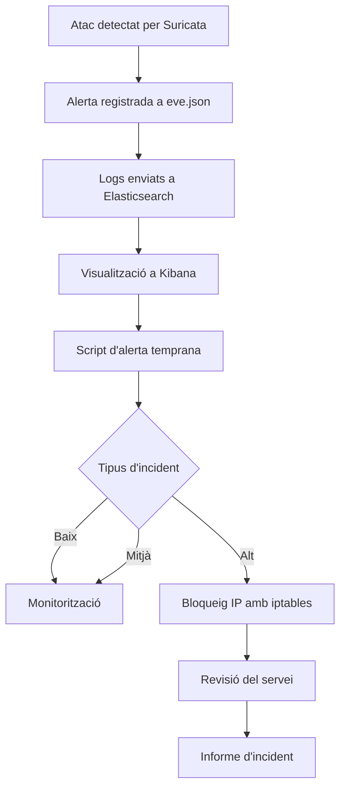

# Pla de Resposta a Incidents

## 1. Objectiu

Aquest document defineix el procediment de resposta davant incidents de seguretat detectats pel sistema **IDS basat en Suricata** implementat al laboratori.

El sistema combina:

- Suricata IDS
- Elastic Stack (Filebeat + Elasticsearch + Kibana)
- sistema d'alerta temprana per correu electrònic
- resposta automàtica mitjançant **iptables**

Els objectius principals són:

- detectar activitats sospitoses a la xarxa
- alertar l’administrador de manera immediata
- aplicar mesures de contenció automàtiques
- reduir l’impacte dels atacs
- millorar contínuament la seguretat del sistema

---

# 2. Classificació d’Incidents

Els incidents detectats pel sistema IDS es classifiquen segons la seva criticitat.

| Nivell | Descripció | Exemple | Acció |
|------|------|------|------|
| **Baix** | Activitat sospitosa sense impacte | Escaneig de ports (Nmap) | Monitorització |
| **Mitjà** | Intent d'accés repetit | Intent d'accés SSH | Alerta + seguiment |
| **Alt** | Atac automatitzat | Força bruta SSH (Hydra) | Bloqueig IP automàtic |
| **Crític** | Accés no autoritzat confirmat | Compromís del servidor | Aïllament del sistema |

---

# 3. Procés de Resposta a Incidents

El procés segueix les fases habituals de gestió d’incidents de seguretat:

1. Detecció  
2. Anàlisi  
3. Contenció  
4. Erradicació  
5. Recuperació  
6. Post-incident  

---

# 4. Diagrama de Flux



---

# 5. Fases del Procés

## 5.1 Detecció

La detecció es produeix quan **Suricata activa una regla de seguretat**.

Aquesta alerta queda registrada al fitxer:

```
/var/log/suricata/eve.json
```

Informació registrada:

- timestamp
- IP origen
- IP destí
- port
- signatura de la regla
- tipus d'esdeveniment

Exemples de signatures detectades al laboratori:

- `SCAN detectat contra infraestructura`
- `Possible escaneig de ports`
- `Intent d'acces SSH detectat`
- `Possible brute force SSH`
- `Acces HTTP a servidor web detectat`

---

## 5.2 Anàlisi

Les alertes són analitzades mitjançant:

- logs de Suricata
- dashboards de Kibana
- correlació d'esdeveniments

Objectiu:

- determinar si és un fals positiu
- identificar l’origen de l’atac
- classificar la gravetat de l’incident

---

## 5.3 Contenció

Segons el tipus d’incident es prenen diferents mesures.

### Incident Baix

Exemple:

- escaneig de ports amb Nmap

Accions:

- registrar l'esdeveniment
- monitoritzar l'activitat

---

### Incident Mitjà

Exemple:

- intents puntuals d'accés SSH

Accions:

- registre de l'esdeveniment als logs de Suricata
- visualització a Kibana
- monitorització de l'activitat

En aquest nivell no s'aplica bloqueig automàtic ni alerta immediata per evitar falsos positius.

---

### Incident Alt

Exemple:

- atac de força bruta SSH detectat amb Hydra

Accions:

- alerta immediata per correu
- bloqueig automàtic de la IP atacant amb **iptables**

Exemple de bloqueig:

```bash
iptables -A INPUT -s IP_ATACANT -j DROP
```

Aquest mecanisme implementa una **resposta activa davant atacs detectats**.

---

### Incident Crític

Exemple:

- compromís del servidor
- accés no autoritzat confirmat

Accions:

- alerta immediata a l'administrador
- revisió manual dels logs
- anàlisi del sistema afectat
- possible aïllament del node de forma manual

En incidents crítics la resposta requereix intervenció manual de l’administrador per garantir una anàlisi adequada i evitar interrupcions no controlades del sistema.

---

## 5.4 Erradicació

Objectiu: eliminar la causa de l'incident.

Exemples d'accions:

- actualització de configuracions
- modificació de regles IDS
- reforç de credencials
- revisió de serveis exposats

---

## 5.5 Recuperació

Després de la contenció:

- verificar el funcionament dels serveis
- revisar la integritat del sistema
- continuar monitoritzant el trànsit

---

## 5.6 Post-Incident

Després de cada incident es revisa:

- tipus d'atac
- regles activades
- eficàcia de la resposta

Es poden aplicar millores com:

- ajust de regles
- millora de llindars de detecció
- ampliació de mecanismes d'automatització

---

# 6. KPIs de Seguretat

| Indicador | Objectiu |
|------|------|
| Temps de detecció | < 30 segons |
| Temps de resposta | < 1 minut |
| Temps bloqueig IP | < 60 segons |
| Falsos positius | < 10% |

---

# 7. Millora Contínua

El sistema es millora constantment mitjançant:

- revisió de regles de Suricata
- ajust de signatures personalitzades
- millora del sistema d'alerta
- optimització de la resposta automàtica

---

# 8. Conclusions

Aquest pla permet integrar **detecció i resposta davant incidents** dins de la infraestructura del laboratori.

La combinació de:

- Suricata IDS
- Elastic Stack
- sistema d'alerta temprana
- resposta automàtica amb iptables

permet implementar un sistema funcional de **detecció i resposta a intrusions (IDS + Active Response)**.
