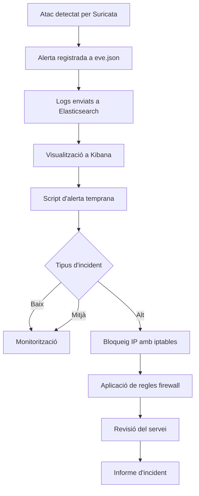

# Pla de Resposta a Incidents

## 1. Objectiu

Aquest document defineix el procediment de resposta davant incidents de seguretat detectats pel sistema **IDS basat en Suricata** implementat al laboratori.

El sistema combina:

- Suricata IDS
- Elastic Stack (Filebeat + Elasticsearch + Kibana)
- sistema d'alerta temprana per correu electrònic
- resposta automàtica mitjançant **iptables**
- firewall per control de trànsit de xarxa
- antivirus ClamAV per protecció a nivell de sistema

Els objectius principals són:

- detectar activitats sospitoses a la xarxa
- alertar l’administrador de manera immediata
- aplicar mesures de contenció automàtiques
- reduir l’impacte dels atacs
- detectar possibles compromisos interns
- millorar contínuament la seguretat del sistema

---

# 2. Classificació d’Incidents

Els incidents detectats pel sistema IDS es classifiquen segons la seva criticitat.

| Nivell | Descripció | Exemple | Acció |
|------|------|------|------|
| **Baix** | Activitat sospitosa sense impacte | Escaneig de ports (Nmap) | Monitorització |
| **Mitjà** | Intent d'accés repetit o comportament anòmal | Connexions sospitoses des de la LAN | Alerta + seguiment |
| **Alt** | Atac automatitzat o comportament clarament maliciós | Força bruta SSH (Hydra), escaneig intern | Alerta + possible bloqueig |
| **Crític** | Accés no autoritzat confirmat | Compromís del servidor | Aïllament del sistema |

---

# 3. Procés de Resposta a Incidents

El procés segueix les fases habituals de gestió d’incidents de seguretat:

1. Detecció  
2. Anàlisi  
3. Contenció  
4. Erradicació  
5. Recuperació  
6. Post-incident  

---

# 4. Diagrama de Flux

---

# 5. Fases del Procés

## 5.1 Detecció

La detecció es produeix quan **Suricata activa una regla de seguretat**.

Aquesta alerta queda registrada al fitxer:

/var/log/suricata/eve.json

Informació registrada:

- timestamp  
- IP origen  
- IP destí  
- port  
- signatura de la regla  
- tipus d'esdeveniment  

Exemples de signatures detectades al laboratori:

- `SCAN detectat contra infraestructura`
- `Possible escaneig de ports`
- `Intent d'acces SSH detectat`
- `Possible brute force SSH`
- `Acces HTTP a servidor web detectat`
- `SCAN sortint des de LAN`
- `Connexio a serveis administratius externs`
- `Connexions repetides sospitoses des de LAN`

---

## 5.2 Anàlisi

Les alertes són analitzades mitjançant:

- logs de Suricata  
- dashboards de Kibana  
- correlació d'esdeveniments  

Objectiu:

- determinar si és un fals positiu  
- identificar l’origen de l’atac  
- detectar comportament anòmal intern  
- classificar la gravetat de l’incident  

---

## 5.3 Contenció

Segons el tipus d’incident es prenen diferents mesures.

### Incident Baix

Exemple:

- escaneig de ports extern

Accions:

- registrar l'esdeveniment  
- monitoritzar l'activitat  

---

### Incident Mitjà

Exemples:

- connexions sospitoses des de la LAN  
- accés a serveis administratius externs  

Accions:

- registre als logs de Suricata  
- visualització a Kibana  
- notificació per correu  
- seguiment de l’activitat  

---

### Incident Alt

Exemples:

- atac de força bruta SSH detectat amb Hydra

Accions:

- alerta immediata per correu  
- bloqueig automàtic de la IP amb **iptables**  

Exemple de bloqueig:

iptables -A INPUT -s IP_ATACANT -j DROP  

Aquest mecanisme implementa una **resposta activa davant atacs detectats**.

---

### Incident Crític

Exemple:

- compromís del servidor  
- execució de malware detectat per ClamAV  

Accions:

- alerta immediata a l'administrador  
- revisió manual dels logs  
- anàlisi del sistema  
- possible aïllament del node  
- escaneig complet amb antivirus  

---

## 5.4 Erradicació

Objectiu: eliminar la causa de l'incident.

Exemples d'accions:

- modificació de regles IDS  
- reforç de configuracions  
- revisió de serveis exposats  
- eliminació de fitxers maliciosos detectats per ClamAV  

---

## 5.5 Recuperació

Després de la contenció:

- verificar el funcionament dels serveis  
- revisar la integritat del sistema  
- continuar monitoritzant el trànsit  
- validar que no hi ha activitat sospitosa interna  

---

## 5.6 Post-Incident

Després de cada incident es revisa:

- tipus d'atac  
- regles activades  
- eficàcia de la resposta  

Millores aplicades:

- ajust de regles de Suricata  
- millora del firewall  
- optimització de llindars  
- ampliació del sistema d’alerta  

---

# 6. KPIs de Seguretat

| Indicador | Objectiu |
|------|------|
| Temps de detecció | < 30 segons |
| Temps de resposta | < 1 minut |
| Temps bloqueig IP | < 60 segons |
| Falsos positius | < 10% |

---

# 7. Millora Contínua

El sistema es millora constantment mitjançant:

- revisió de regles de Suricata  
- millora del firewall amb iptables  
- ampliació de detecció de comportament intern  
- optimització del sistema d’alerta  
- integració de protecció a nivell de sistema amb antivirus  

---

# 8. Conclusions

Aquest pla permet integrar **detecció i resposta davant incidents** dins de la infraestructura del laboratori.

La combinació de:

- Suricata IDS  
- Elastic Stack  
- sistema d'alerta temprana  
- resposta automàtica amb iptables  
- firewall de control de trànsit  
- antivirus ClamAV  

permet implementar un sistema complet de **detecció i resposta a intrusions (IDS + IPS)** amb capacitat de detectar tant amenaces externes com comportament sospitós intern.
